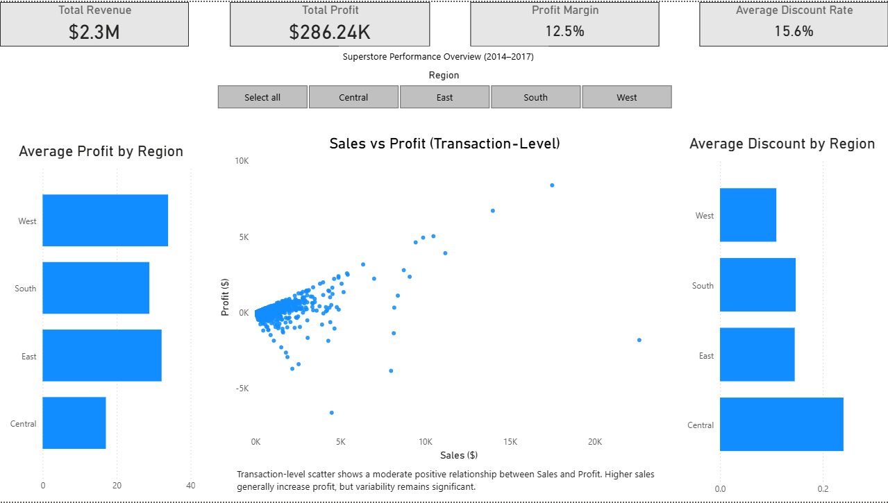

# Superstore Regional Profitability & Discount Analysis

## Overview
This project presents an interactive Power BI dashboard analyzing 9,000+ Superstore transactions to evaluate regional sales performance, profitability trends, and the impact of discount strategies on margin outcomes.

The objective was to identify performance gaps across regions and determine whether discount behavior contributed to reduced profitability.

---

## Tools & Technologies
- Power BI
- DAX
- Microsoft Excel
- Regression & Correlation Analysis
- Data Visualization & Dashboard Design

---

## Key Insights
- Identified a moderate positive relationship between Sales and Profit at the transaction level.
- Determined that the Central region underperforms in average profitability compared to other regions.
- Found that elevated average discount rates in the Central region likely contribute to reduced profit margins.
- Designed an interactive regional slicer enabling dynamic user-driven comparison.

---

## Dashboard Features
- KPI summary (Revenue, Profit, Profit Margin, Discount Rate)
- Transaction-level Sales vs. Profit scatter visualization
- Regional profitability comparison
- Regional discount comparison
- Interactive region filter

---

## Files Included
- `Superstore Dashboard.pbix`
- `Dashboard PDF Export.pdf`
- `Cleaned Superstore Dataset.xlsx`
- `Analytical Report.pdf`

